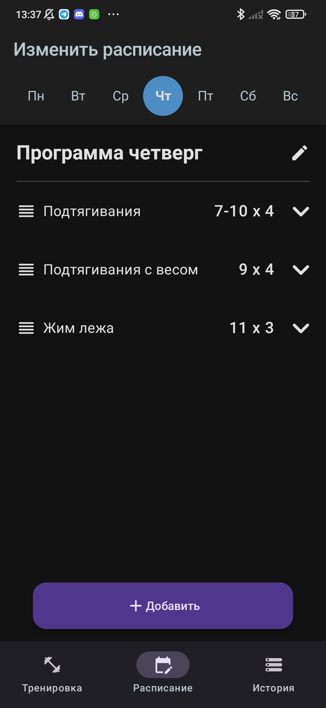
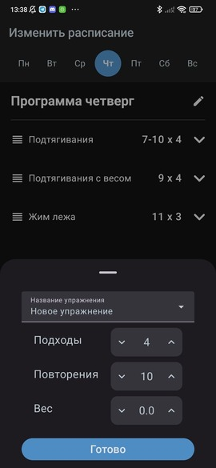
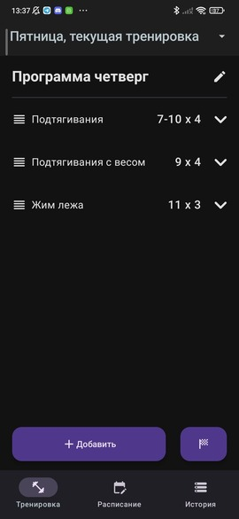
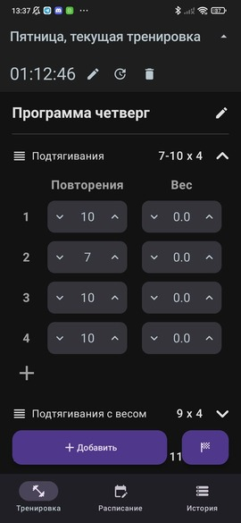
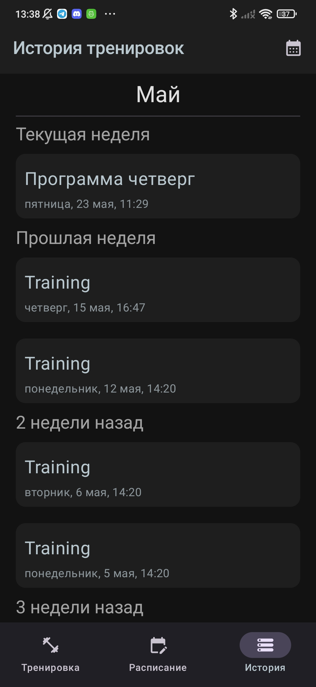
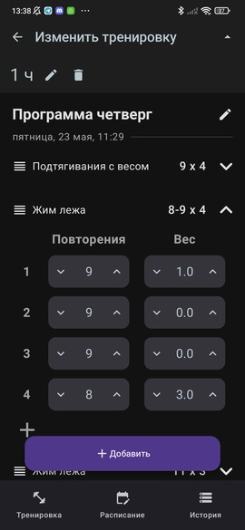
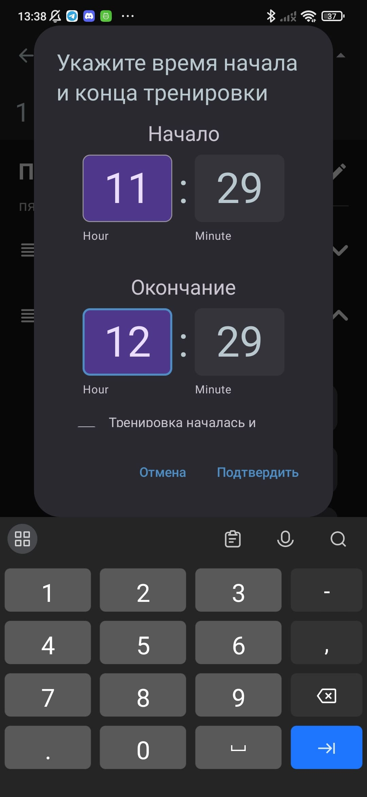

# Gym Tracker

## Description

Gym Tracker is simple and free multiplatform (*iOS*, *Andriod*) application for tracking the results of gym trainings. It allows you to:

1. **Make a training schedule:**

   
   

2. **View current training:**

   

3. **Edit current training and track it's duration:**

   

4. **View training history:**

   

5. **Edit trainings in history:**

   
   

## Technologies

* **Kotlin Multiplatform**
* **Compose Multiplatform** for shared UI
* **Decompose** for navigation
* **MVIKotlin** for MVI pattern
* **SQLDelight** for database